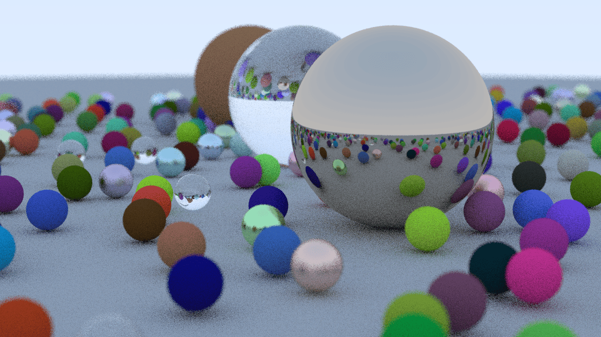

# 3D-renderer
A basic 3D path tracer implemented in C++ 

This is a very basic version and composes this Render

After compiling
The executable will produce the file in the format of `.ppm` 

Gimp is the best Tool to open this type of Image in any OS or you can view the output online `.ppm` viewer
